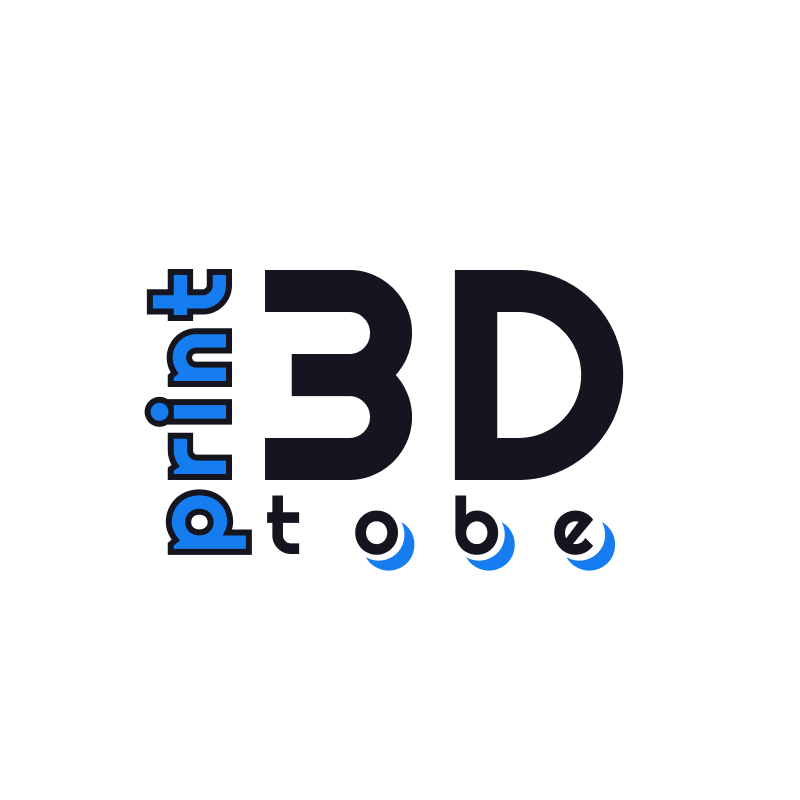

# Hi, I'm Adam 💻

__I__ am a Software Tester who is passionate about making open-source more accessible, creating technology to elevate people, and building community. Some technologies I enjoy working with include ReactJS, VueJS and Django. 

## Find me around the web 🌎: 
- Blogging and sharing code on  <a href="https://www.hvitis.dev">hvitis.dev</a>
- Add me on <a href="https://www.linkedin.com/in/adampi/">LinkedIn</a> 💼
 
### Currently:

- 👯 I'm looking to collaborate / pair program / learn together.
- ⚡ Fun fact: I probably speak your language :)

### I made:

- <a href="https://tobeprint3d.com/">tobeprint3d.com</a> 3D printing community for people who print and want something print3d. 

- <a href="https://youtalky.com/">youtalky.com</a> voice threads to share ideas and thoughts.

- <a href="https://lekcja.online/">lekcja.online</a> language learning courses (my first Django project).

## Technologies I like using:

                 

___

## Some statistics about me:

___

  

### Thanks for visiting!
### Check my repos open for contributing 👇 
